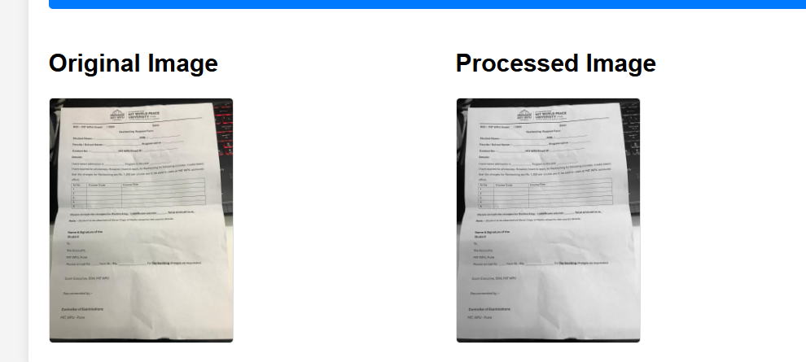

# Text Extraction Project

## Overview

This project only preprocess on the various aspects like removal noise , converting to grayscale 

## Features

- Upload images 
- image are preprocessed so that it can be used further

## Screenshots

### Upload Page


### Results Page



## Installation

1. Clone the repository:
   ```bash
   git clone https://github.com/yourusername/text_extraction_project.git
